# 🎓 LearnOva

LearnOva is a modern and responsive **Learning Management System (LMS)** dashboard built using **React, Vite, Bootstrap, and React Router**. It provides an intuitive interface for managing courses, students, assignments, quizzes, and learning progress through a clean and user-friendly dashboard.

---

## 🚀 Features

- 📊 Interactive Dashboard with statistics cards, weekly learning chart, and calendar
- 📚 Course Catalog with search, category filtering, and course details modal
- 👨‍🎓 Student Management (Add, Remove, Search, and Filter Students)
- 📝 Assignments Management
- ❓ Quizzes
- 🎥 Live Classes
- 📒 Notes
- 💬 Messages
- 🏆 Certificates
- 📅 Calendar
- 👤 Profile Management
- ⚙️ Settings Page
- 🔍 Functional Search Bar
- 🔔 Notifications Dropdown
- 📱 Fully Responsive Design
- 🎨 Modern UI with Sidebar Navigation

---

## 🛠️ Tech Stack

- React
- Vite
- Bootstrap 5
- React Router DOM
- React Icons
- CSS3
- JavaScript (ES6+)

---

## 📖 React Concepts Used

- Props
- useState Hook
- Component Reusability
- Conditional Rendering
- Event Handling
- Array Methods (`map()`, `filter()`)
- React Router
- Responsive Layouts
- Bootstrap Grid System

---

## 📂 Project Structure

```text
src/
│
├── assets/
├── components/
│   ├── Navbar
│   ├── Sidebar
│   ├── Card
│   ├── CourseCard
│   ├── Calendar
│   ├── Chart
│   └── Loader
│
├── layouts/
│   └── MainLayout
│
├── pages/
│   ├── Dashboard
│   ├── Courses
│   ├── Students
│   ├── Assignments
│   ├── Quizzes
│   ├── LiveClasses
│   ├── Notes
│   ├── Messages
│   ├── Certificates
│   ├── Profile
│   └── Settings
│
├── routes/
├── services/
├── styles/
└── data/
```
## 📸 Project Preview

<p align="center">
  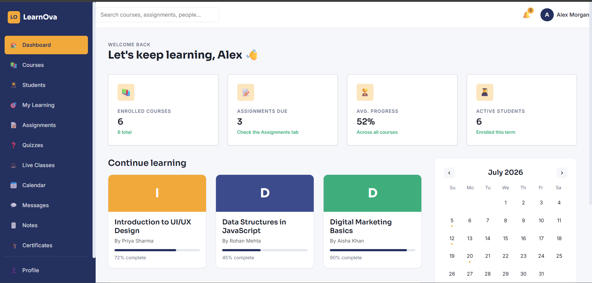
  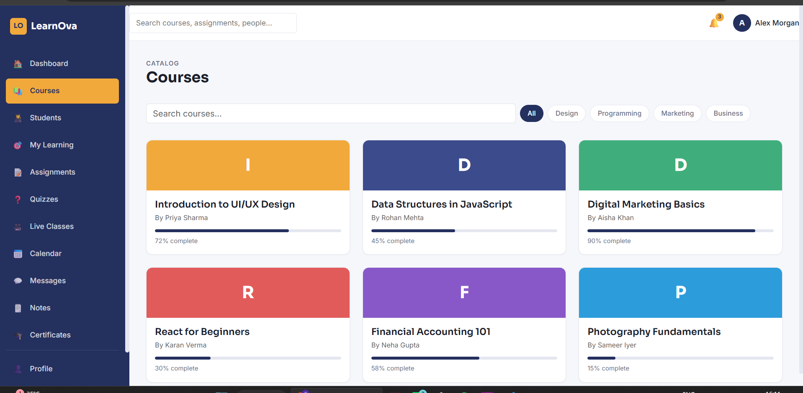
</p>

<p align="center">
  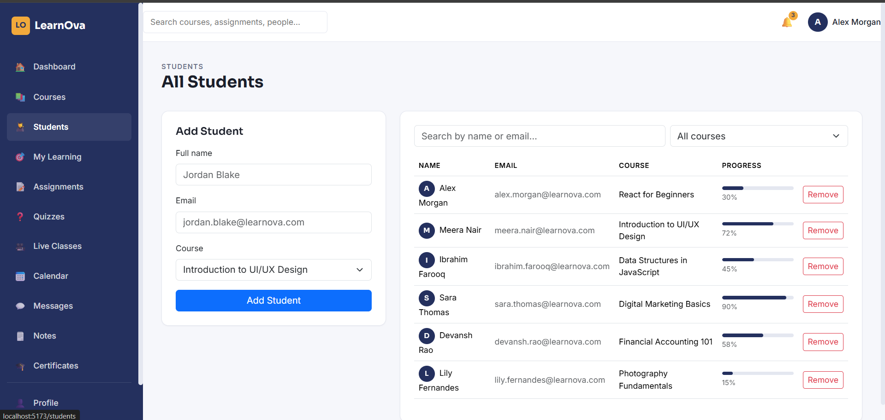
  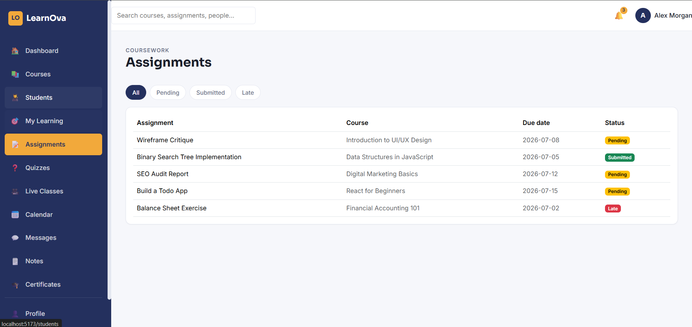
</p>

<p align="center">
  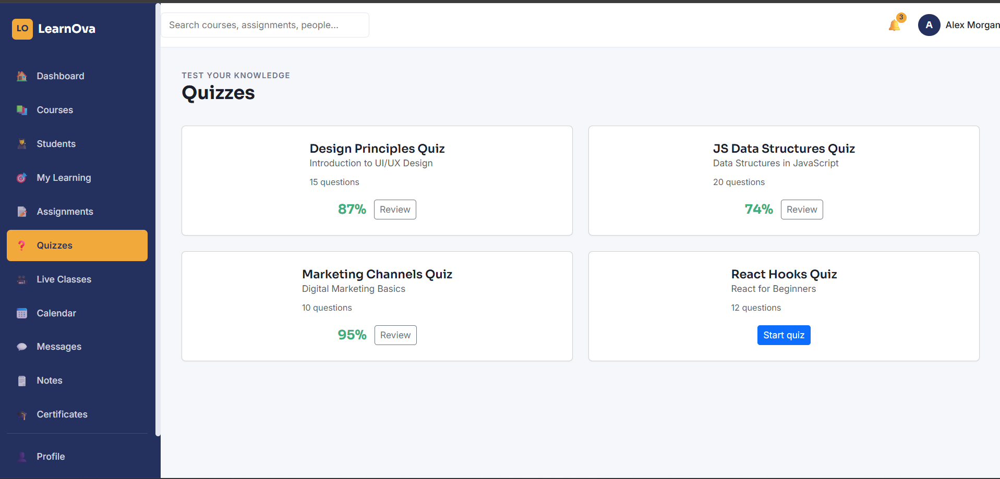
  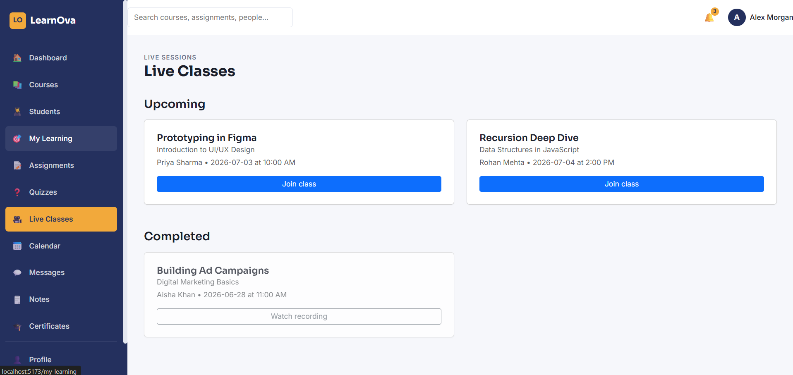
</p>

<p align="center">
  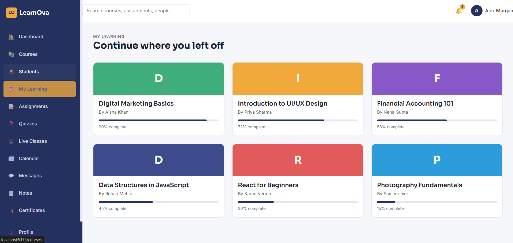
  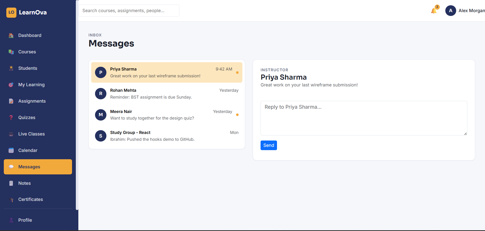
</p>

<p align="center">
  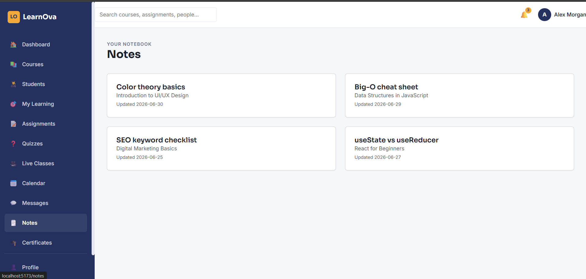
  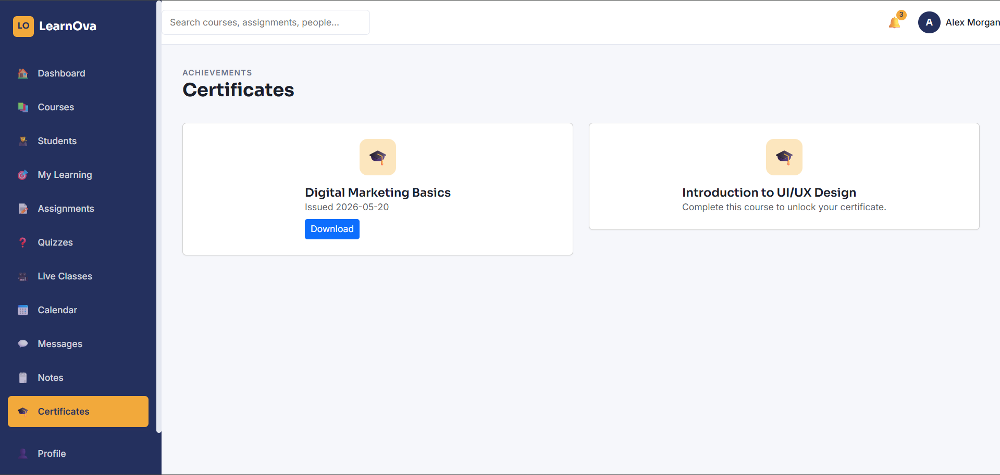
</p>

<p align="center">
  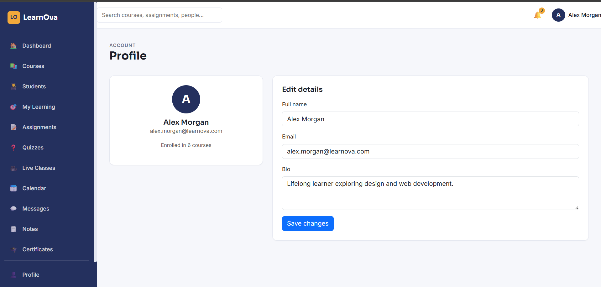
  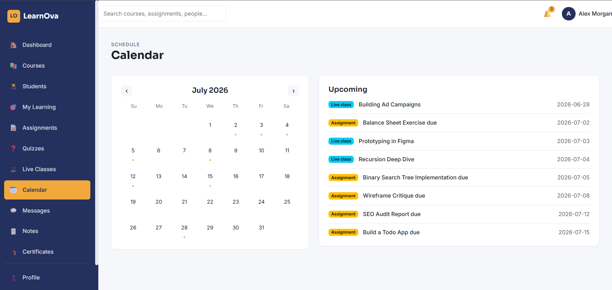
</p>
---

## ⚙️ Installation

Clone the repository

```bash
git clone https://github.com/Srajan0110/LearnOva.git
```

Navigate to the project directory

```bash
cd LearnOva
```

Install dependencies

```bash
npm install
```

Run the development server

```bash
npm run dev
```

---

## 📸 Screenshots

> Add screenshots of your Dashboard, Courses, Student Management, and other pages here.

---

## 🔮 Future Improvements

- Backend Integration (Node.js + Express)
- MongoDB Database
- JWT Authentication
- Role-Based Access (Admin, Teacher, Student)
- Video Lectures
- Progress Tracking
- Certificate Generation
- API Integration

---

## 👨‍💻 Author

**Srajan Shukla**

GitHub: https://github.com/Srajan0110

---

⭐ If you found this project useful, consider giving it a star!
